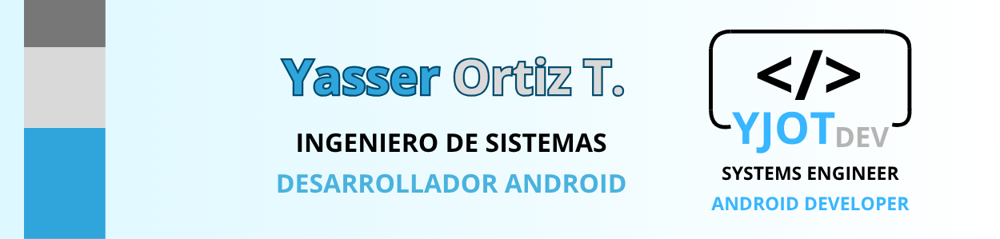

<h2 align="center">👋 Acerca de mí</h2>

Hola, soy Yasser Ortiz  
Ingeniero de Sistemas y Desarrollador Android con 4 años de experiencia en apps móviles nativas. Mi enfoque está en el ecosistema Android moderno, trabajando con Kotlin, Jetpack Compose y XML, aplicando arquitecturas MVVM y Clean Architecture, y garantizando calidad con DI Hilt y pruebas unitarias/instrumentales.

🔧 Stack principal
- Lenguajes y frameworks: Kotlin, Jetpack Compose, XML, Node.js
- Bases de datos: MySQL (local y remoto con Aiven)
- Herramientas: Android Studio, VS Code, MySQL Workbench, Google Cloud, Canva

🧪 Testing & IA
- Pruebas unitarias e instrumentales en todas mis apps.
- Integración de IA (Copilot, Gemini) para optimizar código, pruebas y resolución de bugs.

📂 Portafolio
- Actualmente cuento con 8 aplicaciones móviles documentadas y subidas a GitHub, que reflejan mi compromiso con el código limpio, escalabilidad y buenas prácticas.
- Puedes dar un vistazo a mi portafolio [aqui](https://yjot-dev.github.io/)

<h2 align="center">🛠️ Stack General</h2>

  <table>
  <tr>
    <td align="center"></td>
    <td align="center"></td>
    <td align="center"></td>
    <td align="center"></td>
    <td align="center"></td>
  </tr>
  <tr>
    <td align="center"></td>
    <td align="center"></td>
    <td align="center"></td>
    <td align="center"></td>
    <td align="center"></td>
  </tr>
</table>

<h2 align="center">📬 Contáctame</h2>

  <table>
  <tr>
    <td></td>
    <td></td>
    <td></td>
  </tr>
</table>

